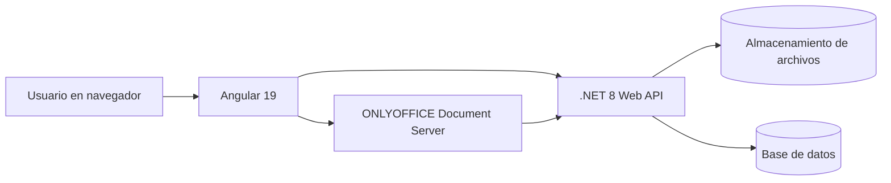
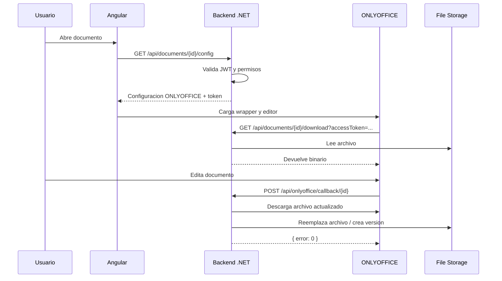
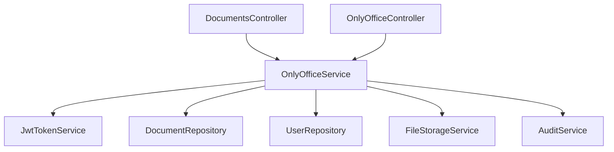
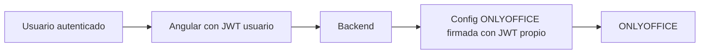
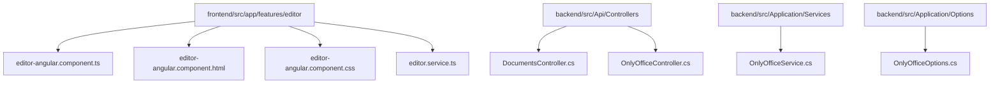

# Guia completa para integrar @onlyoffice/document-editor-angular@6.5.1 en un proyecto con .NET 8 y Angular 19

## Objetivo

Esta guia explica, de principio a fin, como integrar ONLYOFFICE usando el wrapper oficial `@onlyoffice/document-editor-angular@6.5.1` en una arquitectura tipica con:

- un VPS con ONLYOFFICE Document Server ya instalado
- un backend en .NET 8 Web API
- un frontend en Angular 19
- autenticacion JWT
- documentos almacenados en el backend
- guardado real mediante callback de ONLYOFFICE

Esta guia esta pensada para que una persona junior pueda implementarlo en cualquier proyecto con estas caracteristicas.

---

## Resultado final esperado

Al terminar, tu proyecto debe poder:

- autenticar usuarios en Angular
- pedir al backend la configuracion de ONLYOFFICE
- abrir un `DOCX`, `XLSX` o `PPTX` en el navegador
- permitir modo `edit` o `view` segun permisos
- descargar el archivo desde el backend de forma segura
- guardar cambios mediante `callbackUrl`
- crear nuevas versiones si tu backend lo implementa

---

## Arquitectura general



### Idea clave

ONLYOFFICE no sustituye a tu backend.

ONLYOFFICE hace esto:

- renderiza y edita el documento
- llama al callback cuando hay cambios
- descarga el documento desde la URL que tu backend le entrega

Tu backend sigue siendo el centro de control de:

- usuarios
- autenticacion
- permisos
- almacenamiento
- versionado
- auditoria

---

## Flujo completo



---

## Requisitos previos

### Infraestructura

Debes tener disponible:

- un VPS o servidor con ONLYOFFICE Document Server operativo
- una URL publica de ONLYOFFICE, por ejemplo `https://onlyoffice.midominio.com`
- un backend .NET 8 accesible por ONLYOFFICE
- un frontend Angular 19 accesible por navegador

### Software de desarrollo

- Node.js 20+
- npm
- Angular CLI 19
- .NET 8 SDK
- Git
- un editor como VS Code

### Conocimiento minimo recomendado

La persona que implemente esto debe entender al menos:

- rutas HTTP
- JWT basico
- formularios y routing Angular
- controladores y servicios en .NET
- variables de entorno

---

## Conceptos que debes entender antes de empezar

### 1. URL publica de ONLYOFFICE

Es la URL que ve el navegador.

Ejemplo:

```text
https://onlyoffice.midominio.com
```

### 2. URL interna de ONLYOFFICE

Es la URL que usa el backend si ambos estan en red privada, Docker o red interna.

Ejemplo:

```text
http://onlyoffice
```

### 3. callbackUrl

Es el endpoint de tu backend al que ONLYOFFICE avisa cuando hay que guardar cambios.

Ejemplo:

```text
https://api.midominio.com/api/onlyoffice/callback/{id}
```

### 4. downloadUrl

Es la URL que ONLYOFFICE usa para descargar el documento desde tu backend.

Ejemplo:

```text
https://api.midominio.com/api/documents/{id}/download?accessToken=...
```

### 5. JWT de ONLYOFFICE

Es un token independiente del JWT de login del usuario.

Se usa para:

- firmar la configuracion del editor
- validar el callback
- proteger la comunicacion entre backend y ONLYOFFICE

---

## Paso 1. Preparar ONLYOFFICE en el VPS

Si tu servidor de ONLYOFFICE ya existe, verifica lo siguiente.

### Checklist tecnico

- responde por navegador
- tiene HTTPS si vas a usarlo desde internet
- puede cargar `api.js`
- tiene JWT activado
- conoces el secreto JWT exacto

### URL que debes probar

```text
https://onlyoffice.midominio.com/web-apps/apps/api/documents/api.js
```

Si eso no carga, Angular tampoco podra abrir el editor.

### Configuracion minima del servidor

Conceptualmente debes tener algo equivalente a esto:

```yaml
services:
  onlyoffice:
    image: onlyoffice/documentserver:latest
    environment:
      JWT_ENABLED: 'true'
      JWT_SECRET: TU_SECRETO_ONLYOFFICE
      JWT_HEADER: Authorization
    ports:
      - "8080:80"
```

### Error comun

No mezcles el secreto del login de usuarios con el secreto de ONLYOFFICE.

Deben ser secretos distintos.

---

## Paso 2. Preparar el backend .NET 8

Tu backend necesita tres endpoints minimos:

- `GET /api/documents/{id}/config`
- `GET /api/documents/{id}/download`
- `POST /api/onlyoffice/callback/{id}`

### Diagrama de backend



---

## Paso 3. Crear la configuracion de ONLYOFFICE en appsettings

En tu backend, crea una seccion como esta:

```json
{
  "OnlyOffice": {
    "DocumentServerUrl": "https://onlyoffice.midominio.com",
    "InternalDocumentServerUrl": "http://onlyoffice",
    "JwtSecret": "TU_SECRETO_ONLYOFFICE",
    "InternalApiBaseUrl": "https://api.midominio.com",
    "PublicApiBaseUrl": "https://api.midominio.com",
    "UrlExpirationMinutes": 20
  }
}
```

### Significado de cada propiedad

- `DocumentServerUrl`: URL publica del servidor ONLYOFFICE
- `InternalDocumentServerUrl`: URL interna si tu backend no debe usar la URL publica para descargas internas
- `JwtSecret`: secreto compartido con ONLYOFFICE
- `InternalApiBaseUrl`: base que usara ONLYOFFICE para llamar al callback y descargar
- `PublicApiBaseUrl`: base publica de tu API
- `UrlExpirationMinutes`: minutos de validez para tokens temporales

### Clase de opciones en .NET

```csharp
public class OnlyOfficeOptions
{
    public const string SectionName = "OnlyOffice";
    public string DocumentServerUrl { get; set; } = string.Empty;
    public string InternalDocumentServerUrl { get; set; } = string.Empty;
    public string JwtSecret { get; set; } = string.Empty;
    public string InternalApiBaseUrl { get; set; } = string.Empty;
    public string PublicApiBaseUrl { get; set; } = string.Empty;
    public int UrlExpirationMinutes { get; set; } = 20;
}
```

---

## Paso 4. Definir el DTO que Angular va a consumir

Angular necesita un objeto parecido a este:

```json
{
  "documentType": "word",
  "type": "desktop",
  "document": {
    "fileType": "docx",
    "key": "abc-v3",
    "title": "Contrato.docx",
    "url": "https://api.midominio.com/api/documents/123/download?accessToken=...",
    "permissions": {
      "edit": true,
      "download": true,
      "comment": true,
      "review": true,
      "print": true
    }
  },
  "editorConfig": {
    "callbackUrl": "https://api.midominio.com/api/onlyoffice/callback/123",
    "mode": "edit",
    "lang": "es",
    "user": {
      "id": "u1",
      "name": "carlos"
    }
  },
  "token": "JWT_DE_ONLYOFFICE"
}
```

### Regla importante

La `key` del documento debe cambiar cuando cambia la version del archivo.

Si no cambia, ONLYOFFICE puede reutilizar cache vieja.

---

## Paso 5. Implementar el endpoint `GET /config`

En tu `DocumentsController` necesitas algo como esto:

```csharp
[HttpGet("{id:guid}/config")]
public async Task<IActionResult> GetOnlyOfficeConfig(Guid id, CancellationToken cancellationToken)
{
    var userId = User.GetRequiredUserId();
    var role = User.GetRequiredRole();
    var config = await _onlyOfficeService.BuildEditorConfigAsync(id, userId, role, cancellationToken);
    return Ok(config);
}
```

### Que debe hacer internamente

El servicio debe:

1. validar que el documento existe
2. validar que el usuario tiene permisos
3. decidir si el modo es `edit` o `view`
4. generar `downloadUrl`
5. generar `callbackUrl`
6. crear el payload
7. firmarlo con el JWT de ONLYOFFICE

### Ejemplo real de servicio

```csharp
public async Task<OnlyOfficeEditorConfigDto> BuildEditorConfigAsync(Guid documentId, Guid userId, string roleName, CancellationToken cancellationToken = default)
{
    var document = await _documentRepository.GetAccessibleByIdAsync(documentId, userId, roleName, cancellationToken)
        ?? throw new NotFoundException("Documento no encontrado o sin permisos.");

    var user = await _userRepository.GetByIdAsync(userId, cancellationToken)
        ?? throw new UnauthorizedException("Usuario invalido.");

    var permission = GetPermission(document, userId, roleName);
    var editorMode = permission.CanEdit ? "edit" : "view";
    var fileExtension = Path.GetExtension(document.OriginalFileName).TrimStart('.').ToLowerInvariant();
+   var expiresAt = DateTime.UtcNow.AddMinutes(_onlyOfficeOptions.UrlExpirationMinutes);
    var downloadToken = _jwtTokenService.GenerateDownloadToken(document.Id, user.Id, expiresAt);
    var documentUrl = $"{_onlyOfficeOptions.InternalApiBaseUrl.TrimEnd('/')}/api/documents/{document.Id}/download?accessToken={Uri.EscapeDataString(downloadToken)}";
    var callbackUrl = $"{_onlyOfficeOptions.InternalApiBaseUrl.TrimEnd('/')}/api/onlyoffice/callback/{document.Id}";

    var payload = new
    {
        document = new
        {
            fileType = fileExtension,
            key = $"{document.Id:N}-v{document.CurrentVersionNumber}",
            title = document.OriginalFileName,
            url = documentUrl,
            permissions = new
            {
                edit = permission.CanEdit,
                download = true,
                comment = permission.CanEdit,
                review = permission.CanEdit,
                print = true
            }
        },
        documentType = ResolveDocumentType(document.OriginalFileName),
        editorConfig = new
        {
            callbackUrl,
            mode = editorMode,
            lang = "es",
            user = new
            {
                id = user.Id.ToString(),
                name = user.UserName
            }
        },
        type = "desktop"
    };

    return new OnlyOfficeEditorConfigDto
    {
        DocumentType = ResolveDocumentType(document.OriginalFileName),
        Type = "desktop",
        Document = payload.document,
        EditorConfig = payload.editorConfig,
        Token = _jwtTokenService.GenerateOnlyOfficeToken(payload)
    };
}
```

---

## Paso 6. Implementar la descarga segura del archivo

Tu endpoint `download` debe devolver el binario a ONLYOFFICE.

Ejemplo:

```csharp
[AllowAnonymous]
[HttpGet("{id:guid}/download")]
public async Task<IActionResult> Download(Guid id, [FromQuery] string? accessToken, CancellationToken cancellationToken)
{
    Guid? userId = null;
    string? role = null;

    if (User.Identity?.IsAuthenticated == true)
    {
        userId = User.GetRequiredUserId();
        role = User.GetRequiredRole();
    }

    var result = await _documentService.DownloadAsync(id, userId, role, accessToken, cancellationToken);
    return File(result.Stream, result.ContentType, result.FileName);
}
```

### Recomendacion fuerte

Usa token temporal firmado en la URL.

No expongas nunca la ruta fisica real del fichero.

---

## Paso 7. Implementar el callback de ONLYOFFICE

El callback es obligatorio si quieres guardar cambios de verdad.

### Controlador minimo

```csharp
[ApiController]
[AllowAnonymous]
[Route("api/onlyoffice")]
public class OnlyOfficeController : ControllerBase
{
    private readonly IOnlyOfficeService _onlyOfficeService;

    public OnlyOfficeController(IOnlyOfficeService onlyOfficeService)
    {
        _onlyOfficeService = onlyOfficeService;
    }

    [HttpPost("callback/{id:guid}")]
    public async Task<IActionResult> Callback(Guid id, [FromBody] OnlyOfficeCallbackDto request, CancellationToken cancellationToken)
    {
        var result = await _onlyOfficeService.ProcessCallbackAsync(id, request, Request.Headers.Authorization.ToString(), cancellationToken);
        return Ok(result);
    }
}
```

### Que debe hacer el servicio

1. validar JWT del callback
2. ignorar estados que no exijan persistencia
3. descargar el archivo actualizado desde `request.Url`
4. reemplazar el archivo actual
5. crear una nueva version si tu proyecto usa versionado
6. devolver `{ error: 0 }`

### Ejemplo real simplificado

```csharp
public async Task<object> ProcessCallbackAsync(Guid documentId, OnlyOfficeCallbackDto request, string? authorizationHeader, CancellationToken cancellationToken = default)
{
    ValidateCallbackToken(request, authorizationHeader);

    if (request.Status != 2 && request.Status != 6)
    {
        return new { error = 0 };
    }

    var document = await _documentRepository.GetByIdAsync(documentId, cancellationToken)
        ?? throw new NotFoundException("Documento no encontrado.");

    var client = _httpClientFactory.CreateClient(nameof(OnlyOfficeService));
    using var downloadRequest = new HttpRequestMessage(HttpMethod.Get, ResolveCallbackDownloadUrl(request.Url));
    using var response = await client.SendAsync(downloadRequest, HttpCompletionOption.ResponseHeadersRead, cancellationToken);
    response.EnsureSuccessStatusCode();

    await using var responseStream = await response.Content.ReadAsStreamAsync(cancellationToken);
    await _fileStorageService.ReplaceAsync(document.CurrentFilePath, responseStream, cancellationToken);

    return new { error = 0 };
}
```

### Error tipico

Cuando el backend esta en contenedor y usa `localhost:8080` para descargar `request.Url`, falla.

Por eso necesitas una logica como `ResolveCallbackDownloadUrl` que convierta la URL publica en URL interna.

---

## Paso 8. Preparar Angular 19

Instala la dependencia oficial:

```bash
npm install @onlyoffice/document-editor-angular@6.5.1
```

### Si Angular muestra warning por CommonJS

Anade esto a `angular.json`:

```json
"allowedCommonJsDependencies": [
  "lodash"
]
```

### Dependencia instalada

```json
"dependencies": {
  "@onlyoffice/document-editor-angular": "^6.5.1"
}
```

---

## Paso 9. Configurar environment en Angular

Define al menos estas variables:

```ts
export const environment = {
  production: false,
  apiBaseUrl: 'https://api.midominio.com',
  onlyOfficeUrl: 'https://onlyoffice.midominio.com'
};
```

### Regla importante

- `apiBaseUrl` es la URL del backend
- `onlyOfficeUrl` es la URL publica del servidor ONLYOFFICE

---

## Paso 10. Crear el servicio Angular del editor

Servicio minimo:

```ts
import { HttpClient } from '@angular/common/http';
import { Injectable } from '@angular/core';
import { Observable } from 'rxjs';
import { environment } from '../../../environments/environment';

export interface OnlyOfficeConfig {
  documentType: string;
  type: string;
  document: Record<string, unknown>;
  editorConfig: Record<string, unknown>;
  token: string;
}

@Injectable({ providedIn: 'root' })
export class EditorService {
  constructor(private readonly http: HttpClient) {}

  getConfig(documentId: string): Observable<OnlyOfficeConfig> {
    return this.http.get<OnlyOfficeConfig>(`${environment.apiBaseUrl}/api/documents/${documentId}/config`);
  }
}
```

---

## Paso 11. Crear el componente Angular con el wrapper oficial

### TypeScript completo

```ts
import { Component, OnInit } from '@angular/core';
import { ActivatedRoute } from '@angular/router';
import { IConfig } from '@onlyoffice/document-editor-angular';
import { switchMap } from 'rxjs';
import { environment } from '../../../environments/environment';
import { EditorService, OnlyOfficeConfig } from './editor.service';

@Component({
  selector: 'app-editor-angular',
  standalone: false,
  templateUrl: './editor-angular.component.html',
  styleUrls: ['./editor-angular.component.css']
})
export class EditorAngularComponent implements OnInit {
  loading = true;
  errorMessage = '';
  config: IConfig | null = null;
  readonly documentServerUrl = environment.onlyOfficeUrl;
  readonly editorElementId = 'onlyoffice-angular-editor-host';

  constructor(
    private readonly route: ActivatedRoute,
    private readonly editorService: EditorService
  ) {}

  ngOnInit(): void {
    this.route.paramMap
      .pipe(switchMap((params) => this.editorService.getConfig(params.get('id') ?? '')))
      .subscribe({
        next: (config) => {
          this.config = this.mapConfig(config);
          this.loading = false;
        },
        error: (error) => {
          this.errorMessage = error?.error?.error ?? 'No fue posible cargar la configuracion del editor wrapper.';
          this.loading = false;
        }
      });
  }

  readonly onDocumentReady = (): void => {
    this.loading = false;
  };

  readonly onLoadComponentError = (_errorCode: number, errorDescription: string): void => {
    this.errorMessage = errorDescription || 'No fue posible cargar el wrapper oficial de ONLYOFFICE.';
    this.loading = false;
  };

  private mapConfig(config: OnlyOfficeConfig): IConfig {
    return {
      document: config.document as IConfig['document'],
      documentType: config.documentType as IConfig['documentType'],
      editorConfig: config.editorConfig as IConfig['editorConfig'],
      token: config.token,
      type: config.type,
      width: '100%',
      height: '100%'
    };
  }
}
```

### Template HTML completo

```html
<section class="editor-page">
  <p *ngIf="loading">Cargando editor ONLYOFFICE...</p>
  <p class="error-text" *ngIf="errorMessage">{{ errorMessage }}</p>

  <div class="editor-frame" *ngIf="config && !errorMessage">
    <document-editor
      [id]="editorElementId"
      [documentServerUrl]="documentServerUrl"
      [config]="config"
      [width]="'100%'"
      [height]="'100%'"
      [events_onDocumentReady]="onDocumentReady"
      [onLoadComponentError]="onLoadComponentError"
    ></document-editor>
  </div>
</section>
```

### CSS minimo recomendado

```css
.editor-page {
  display: grid;
  gap: 16px;
  height: calc(100vh - 88px);
}

.editor-frame {
  height: 100%;
  min-height: 0;
  overflow: hidden;
}

document-editor {
  display: block;
  width: 100%;
  height: 100%;
}
```

---

## Paso 12. Importar el modulo del wrapper

En un proyecto modular clasico, importa esto en el modulo del editor:

```ts
import { NgModule } from '@angular/core';
import { DocumentEditorModule } from '@onlyoffice/document-editor-angular';
import { SharedModule } from '../../shared/shared.module';
import { EditorAngularComponent } from './editor-angular.component';

@NgModule({
  declarations: [EditorAngularComponent],
  imports: [SharedModule, DocumentEditorModule]
})
export class EditorModule {}
```

---

## Paso 13. Crear la ruta Angular

```ts
const routes: Routes = [
  {
    path: 'angular/:id',
    component: EditorAngularComponent
  }
];
```

Luego navega con algo como:

```ts
this.router.navigate(['/editor', 'angular', documentId]);
```

---

## Paso 14. Autenticacion JWT del usuario

El wrapper de ONLYOFFICE no reemplaza la autenticacion de Angular.

Tu frontend debe seguir usando:

- login normal con JWT
- `HttpInterceptor` para adjuntar el token
- `AuthGuard` para proteger la ruta del editor

### Diagrama de seguridad



Hay dos capas de seguridad:

- JWT del usuario para que Angular hable con tu API
- JWT de ONLYOFFICE para que el editor y el callback sean validos

---

## Paso 15. Archivos minimos que debes copiar a otro proyecto

Si solo quieres reutilizar esta integracion en otro proyecto con Angular 19 y .NET 8, copia como minimo:

### Angular

- `editor-angular.component.ts`
- `editor-angular.component.html`
- `editor-angular.component.css`
- `editor.service.ts`
- `EditorModule` o el modulo equivalente
- `environment.ts` y `environment.prod.ts`
- el modelo `OnlyOfficeConfig`

### Backend

- `OnlyOfficeOptions`
- `OnlyOfficeController`
- endpoint `GET /api/documents/{id}/config`
- endpoint `GET /api/documents/{id}/download`
- endpoint `POST /api/onlyoffice/callback/{id}`
- `OnlyOfficeService`
- `JwtTokenService`
- `FileStorageService`

### Configuracion

- `@onlyoffice/document-editor-angular@6.5.1` en `package.json`
- `allowedCommonJsDependencies: ["lodash"]` en `angular.json`
- secretos y URLs de ONLYOFFICE en `appsettings` o variables de entorno

---

## Paso 16. Plan de implementacion recomendado para un junior

Hazlo exactamente en este orden:

1. levantar y validar ONLYOFFICE
2. comprobar que `api.js` responde
3. configurar `OnlyOfficeOptions` en backend
4. implementar DTO de configuracion
5. implementar `GET /config`
6. implementar `GET /download`
7. implementar `POST /callback`
8. probar callback con Postman o logs
9. instalar `@onlyoffice/document-editor-angular@6.5.1`
10. crear `EditorService` Angular
11. crear `EditorAngularComponent`
12. crear ruta Angular
13. abrir un `DOCX`
14. abrir un `XLSX`
15. abrir un `PPTX`
16. editar y guardar
17. comprobar que el backend recibe callback
18. comprobar que el archivo se reemplaza o versiona

No mezcles todos los pasos a la vez.

---

## Paso 17. Validacion tecnica final

### Checklist de ONLYOFFICE

- `api.js` carga
- el editor abre el documento
- el documento tiene `key` correcta
- el editor entra en modo `edit` o `view` segun permisos

### Checklist de backend

- `GET /config` devuelve JSON valido
- `GET /download` devuelve el binario
- `POST /callback` devuelve `{ error: 0 }`
- el backend puede descargar `request.Url`

### Checklist de Angular

- la ruta del editor existe
- el `document-editor` renderiza
- el wrapper no muestra error de carga
- el componente ocupa toda la altura necesaria

---

## Problemas mas frecuentes y como resolverlos

## 1. El editor no carga

### Causas posibles

- `documentServerUrl` incorrecta
- `api.js` no accesible
- CORS
- certificado HTTPS invalido

### Que revisar

- abre `https://tu-onlyoffice/web-apps/apps/api/documents/api.js`
- revisa consola del navegador
- revisa logs del servidor ONLYOFFICE

## 2. El documento abre pero no guarda

### Causas posibles

- `callbackUrl` mal construida
- callback no accesible desde ONLYOFFICE
- JWT del callback invalido
- backend no puede descargar `request.Url`

### Que revisar

- logs del backend
- logs de ONLYOFFICE
- respuesta del callback
- si devuelve exactamente `{ error: 0 }`

## 3. Error de red en el callback

### Causa tipica

Tu backend esta usando `localhost` cuando deberia usar una URL interna.

### Solucion

Usa una propiedad tipo `InternalDocumentServerUrl` y reescribe la URL del callback cuando sea necesario.

## 4. El editor muestra un documento viejo

### Causa tipica

La `key` del documento no cambia entre versiones.

### Solucion

Haz que la `key` incluya version, por ejemplo:

```text
{documentId}-v{version}
```

---

## Buenas practicas

- separa JWT usuario y JWT ONLYOFFICE
- no expongas rutas fisicas reales del archivo
- usa `downloadUrl` firmada temporalmente
- usa `callbackUrl` estable y accesible
- registra auditoria de cambios
- cambia la `key` cuando cambie la version
- usa URL publica en navegador y URL interna entre servicios cuando haga falta

---

## Estructura recomendada del proyecto



---

## Resumen ejecutivo para implementarlo rapido

Si tuvieras que explicarselo a alguien en 30 segundos:

1. Angular pide al backend una configuracion de ONLYOFFICE.
2. El backend la genera con permisos, `downloadUrl`, `callbackUrl` y token firmado.
3. El wrapper `@onlyoffice/document-editor-angular@6.5.1` monta el editor en Angular.
4. ONLYOFFICE descarga el archivo desde tu API.
5. Cuando el usuario guarda, ONLYOFFICE llama al callback de tu backend.
6. Tu backend descarga la version actualizada y la guarda.

---

## Siguiente paso recomendado

Cuando esta integracion funcione, crea una pantalla de ejemplo dentro de tu proyecto con:

- wrapper Angular oficial
- ejemplo manual con `api.js`
- snippets embebidos
- explicacion para reutilizarla en otros proyectos

Eso convierte tu implementacion en una base replicable para otros equipos.
